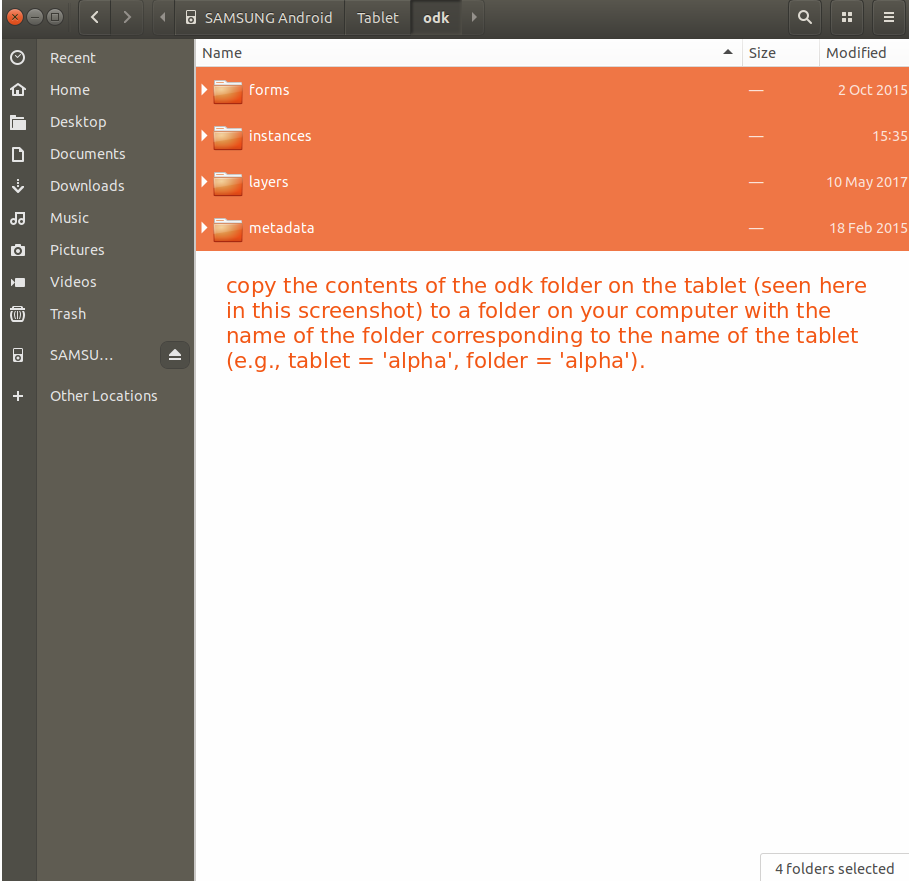

# desfert-stems

This repository contains the materials for creating the ODK stems app, and tools & procedures for processing collected data.

### transfer collected data from the tablets

There are two workflows for converting ODK XML data to tabular form, one employing ODK's Briefcase tool and the other employing custom R scripts. The ODK Briefcase workflow was used until the fall 2020 collection, when it stopped working. This is likely due to the age of the cndep stems app. However, previous collections using previous versions of the ODK Briefcase tool did not seem to work either, so there could be a combination of Java + app + Briefcase interactions causing a problem. As this could not be resolved, custom scripts for converting ODK XML data to tabular form were developed to access the fall 2020 collection data. See `workflow_briefcase.R` for step-by-step instructions for the ODK Briefcase workflow, and `workflow_xml.R` for step-by-step instructions to extract the data using the custom R scripts. Regardless of the workflow employed to extract the ODK XML data and convert to tabular form, use `populate_database.R`, with only minor deviances between workflows, for uploading the stems data to the database.

**tablet to computer**

Copy the contents of the ODK folder from each tablet into a folder with the corresponding name of the tablet (alpha, bravo, charlie, delta).


**workflow: ODK Briefcase**

- Use [ODK briefcase](https://docs.opendatakit.org/briefcase-intro/) to extract tablet XML data into tabular form
  + Run *unextracted* briefcase java program from command line with ```java -jar ODK\ Briefcase\ v1.5.0\ Production.jar```. Note that this path will be different depending on the details of the Briefcase installation. A new version of Briefcase is usually downloaded with each use rather than storing it, so details such as the version number (and the corresponding file/path) will be different each time. The steps here are specific to Linux.
  + set a Briefcase storage location (any empty directory)
  + *Pull* (collect data option) data from each tablet using Briefcase into the aforementioned storage location
  + *Export* pulled data from the Briefcase storage location into a folder titled `superfolder`
  + merge data from multiple directories/tablets^*^
- Add the directories with the extracted data to a new directory titled 'superfolder'.
- Add the `merge.sh` script to the superfolder directory and run, this will combine data extracted from multiple tablets into common files.
- Use `workflow_briefcase.R` and `populate_database.R` to extract and upload data.

^*^it is not clear that the merge step is required so long as tablet data are *pulled* to a single, common Briefcase storge location, then *exported* to a single export location (e.g., 'superfolder' from above). This section left in the workflow pending confirmation.

**workflow: custom scripts**

- Use `workflow_xml.R` and `populate_database.R` to extract and upload data.
