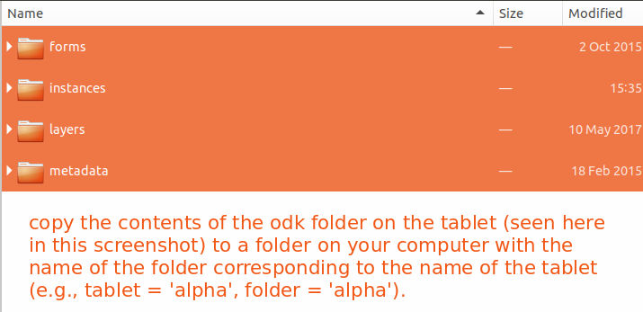

# desfert-stems

This repository contains the materials for creating the ODK stems app, and tools & procedures for processing collected data.

### transfer collected data from the tablets

#### tablet to computer

1. Copy the contents of the ODK folder from each tablet into a folder with the corresponding name of the tablet (alpha, bravo, charlie, delta).


#### extract data with ODK Briefcase

2. Use [ODK briefcase](https://docs.opendatakit.org/briefcase-intro/) to extract tablet XML data into tabular form
    + Run *unextracted* briefcase java program from command line with ```java -jar ODK\ Briefcase\ v1.5.0\ Production.jar```. Note that this path will be different depending on the details of the Briefcase installation. Stevan typically downloads a new version of Briefcase with each use rather than storing it, so details such as the version number (and the corresponding file/path) will be different each time. Briefcase will likely be a clickable executable in a Windows environment (and, possibly, Mac) - the workflow here is specific to Linux.
    + Set a Briefcase storage location (any empty directory).
    + *Pull* (collect data option) data from each tablet using Briefcase into the aforementioned storage location.
    + *Export* pulled data from the Briefcase storage location into a folder titled 'superfolder'.
    
#### merge data from multiple directories/tablets

UPDATE 2018-10-18: it is not clear that the merge step is required so long as tablet data are *pulled* to a single, common Briefcase storge location, then *exported* to a single export location (e.g., 'superfolder' from above). This section left in the workflow pending confirmation.

3. Add the directories with the extracted data to a new directory titled 'superfolder'.
4. Add the merge.sh script to the superfolder directory and run, this will combine data extracted from multiple tablets into common files.

####

5. Run through steps outlined in stemMigration.R for data quality control and upload to the database.